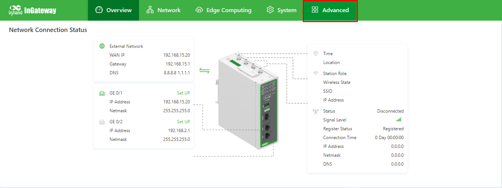
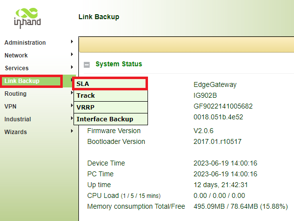
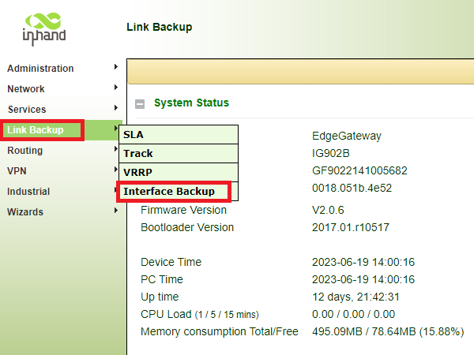
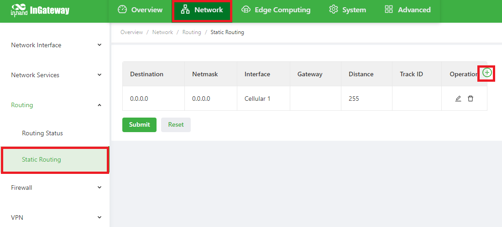
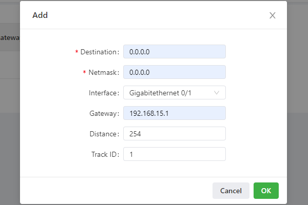
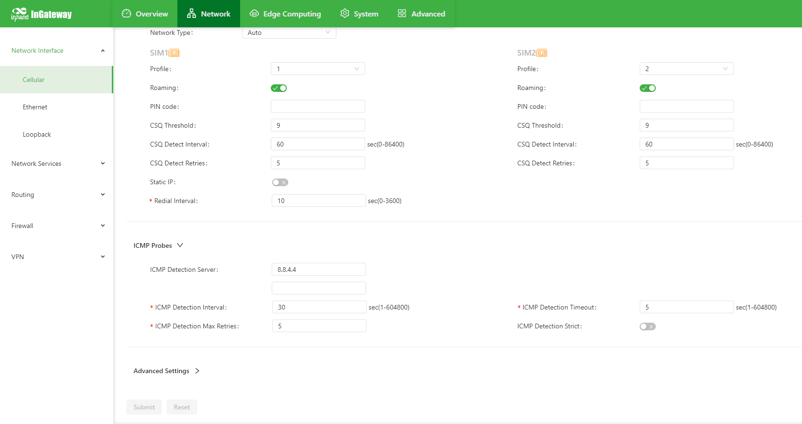

# InGatewayLinkBackup
Guia de configuração do Link Backup IG502/IG902

# Configuração de Link Backup IG502/IG902

  - [1. Introdução ao Link Backup](#intro-linkbackup)
  - [2. Configuração do Link Backup](#config-linkbackup)
    - [2.1 SLA](#sla)
      - [2.1.1 SLA Status](#sla-status)
    - [2.2 Track](#track)
      - [2.2.1 Track Status](#track-status)
    - [2.3 Interface Backup](#interfacebackup)
      - [2.3.1 Interface Backup Status](#interfacebackup-status)
    - [2.4 Rota Estática](#staticroute)
  - [3. Notas](#notas)
    - [3.1 Roteamento Estático ICMP](#staticroutingicmp)
    - [3.2 Cellular ICMP Probe](#cellularicmp)
    - [3.3 IP Fixo](#staticip)
    - [3.4 Configuração em Batelada](#batchconfig)
    - [3.5 Configuração do DNS](#configdns)

<a id="intro-linkbackup"> </a>

## 1. Introdução ao Link Backup

Link Backup é uma função dos InGateways InHand IG502 e IG902. Essa função permite que seja configurada 2 formas de acesso à alguma rede Internet, sendo uma delas a forma principal e outra sendo secundária cumprindo o papel de Backup.

<a id="config-linkbackup"> </a>
## 2. Configuração do Link Backup
Para configurar o Link Backup acesse a aba Advanced. Um pop-up solicitando usuário e senha deve surgir, se não abrir verifique se o navegador está bloqueando esse pop-up.
Abaixo a indicação da aba Advanced:



<a id="sla"> </a>
### 2.1 SLA
O primeiro passo da configuração do Link Backup é criar um **SLA** (Service Level Agreement), que irá monitorar a condição de internet seguindo os parâmetros definidos.
Acesse o item SLA através da aba Link Backup, como ilustrado abaixo:



O **SLA** é parametrizado conforme abaixo:

* **Type**:  **icmp-echo**, mais popularmente conhecido como "ping"
* **Destination Address**:  um endereço IP ao qual o pacote ICMP será direcionado
* **Data size**:  tamanho do pacote (56 bytes por padrão)
* **Interval(s)**:  tempo entre testes do monitoramento
* **Timeout(ms)**:  tempo de espera do echo do pacote ICMP
* **Consecutive**:  quantidade de testes consecutivos a cada intevalo de monitoramento 

Clique em **Add** para adicionar e **Apply** para configurar.


<a id="sla-status"> </a>
#### 2.1.1 SLA Status
Na aba **Status** é possível acompanhar o resultado dos _Service Level Agreements_, caso esteja _up_ o monitoramento o pacote ICMP foi bem sucedido:


<a id="track"> </a>
### 2.2 Track
O segundo passo da configuração é criar um **Track**, que irá possui um **Index** no qual será apontado na tabela de Link Backup e roteamento.
Acesse o item Track através da aba Link Backup, como ilustrado abaixo:


O **Track** é parametrizado conforme abaixo:

*  **Index**:  número que indica o índice do **Track**
*  **Type**:  tipo do _Tracking_, neste caso será **SLA**
*  **SLA ID/VRRP ID**:  _ID_ do **SLA** já configurado
*  **Negative Delay**:  tempo para que o **Track** seja declarado como _Down_ (fora de funcionamento)
*  **Positive Delay**:  tempo para que o **Track** seja declarado como _Up_ (em funcionamento)

Clique em **Add** para adicionar e **Apply** para configurar.


<a id="track-status"> </a>
#### 2.2.1 Track Status
Na aba **Status** é possível acompanhar o resultado dos _Trackings_, caso esteja _positive_ o monitoramento do SLA foi bem sucedido:


<a id="interfacebackup"> </a>
### 2.3 Interface Backup
O terceiro passo da configuração é definir qual interface será a principal e a secundária.
Acesse o item Interface Backup através da aba Link Backup, como ilustrado abaixo:



O item **Interface Backup** é parametrizado conforme abaixo:

*  **Main Interface**:  interface de rede principal
*  **Backup Interface**:  interface de rede secundária
*  **Startup Delay**:  tempo entre a incialização do InGateway e a inicialização do serviço de Link Backup
*  **Up Delay**:  tempo entre o **Track** em _Up_ e a troca da inteface de rede para a principal
*  **Down Delay**:  tempo entre o **Track** em _Down_ e a troca da inteface de rede para a secundária

Clique em **Add** para adicionar e **Apply** para configurar.


<a id="interfacebackup-status"> </a>
#### 2.3.1 Interface Backup Status
Na aba **Status** é possível acompanhar qual interface está ative, a principal é denotada como _main_ e a secundária como _backup_:


<a id="staticroute"> </a>
### 2.4 Rota Estática
O quarto e último passo é configurar uma rota para a interface principal, se ela já não estiver criada.
Caso já exista uma rota estática para a interface principal, adicione o número o **Track ID** já configurado.

Siga o exemplo abaixo:
Para configurar basta acessar **Static Routing** na aba **Network**. Clique no símbolo de mais para adicionar ou no lápis para editar uma rota existente.



Preencha os parâmetros:



Clique em **OK** para adicionar e **Apply** para configurar.

<a id="notas"> </a>
## 3 Notas
Algumas outras questões devem ser levadas em consideração na hora de configura o Link Backup, entre elas estão a inclusão de roteamento estático para o SLA configurado e o Cellular ICMP Probe:

<a id="staticroutingicmp"> </a>
### 3.1 Roteamento Estático ICMP
É importante adicionar um roteamento exclusivo para o teste de ICMP que foi configurado em SLA, esse roteamento faz com que o pacote ICMP não seja direcionado para a interface de secundária (Backup) e causando o falso estado do monitoramento da interface principal.
Para configurar basta acessar **Static Routing** na aba **Network**. Clique no símbolo de mais para adicionar uma nova rota.

Preencha os parâmetros com o mesmo **Destination** configurado em **SLA** e selecione a interface principal:


Clique em **OK** para adicionar e **Apply** para configurar.

<a id="cellularicmp"> </a>
### 3.2 Cellular ICMP Probe
Cuidado ao utilizar Link Backup com **ICMP Probe** configurado em Cellular. Ao travar um rota estática para determinado IP, é muito importante verificar se esse mesmo IP não está sendo utilizado como **ICMP Probe** para monitorar o estado da rede celular e alternar o chip.

Acesse o item **Cellular** na aba **Network**, altere o **ICMP Detection Server** para IP que não coincida com os eventuais IPs configurados em SLA.
Uma dica é utilizar endereço secundários de DNS, como o 8.8.4.4 da Google e 1.0.0.1 da Cloudflare.




<a id="staticip"> </a>
### 3.3 IP Fixo
Para configurar um IP Fixo (IP Estático), basta acessar a aba  **Network** e o item **Ethernet**. Acesse a porta de rede qual deseja configurar e na opção **Network Type** escolha _Static IP_. Preencha o endereço de IP e a máscara da rede e clique em **Submit** para finalizar a configuração.


<a id="batchconfig"> </a>
### 3.4 Configuração em Batelada
Para realizar a configuração em batelada através do **InConnect** ou **Device Manager**, utilize o modelo de configuração em texto plano abaixo como referência:

```
#static route config
ip route 0.0.0.0 0.0.0.0 gigabitethernet 0/1 192.168.15.1 254 track 1
!
#sla config
sla 1
  icmp-echo 8.8.8.8
    request-data-size 56
    frequency 30
    timeout 5000
    check-element probe-fail threshold-type consecutive 5
!
sla schedule 1 life forever start-time now
!
#track config
track 1 sla 1 delay negative 5 positive 30
!
#backup config
interface gigabitethernet 0/1
  backup interface cellular 1
  backup startup 10
  backup delay 0 120
  backup track 1
!
```

<a id="configdns"> </a>
### 3.5 Configuração do DNS
Para configurar o DNS, basta acessar na aba **Network**, o item **Network Services**/**DNS**.

Altere os IPs do DNS Primary e/ou Secundary e clique em Submit:


