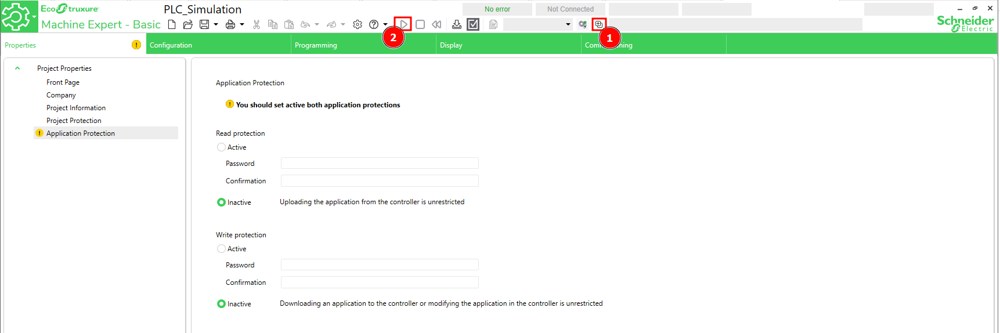
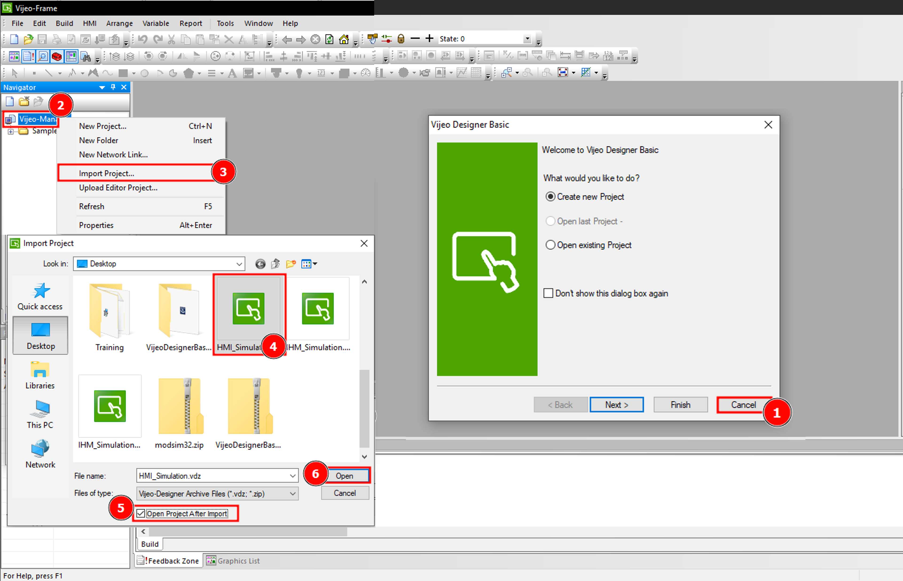
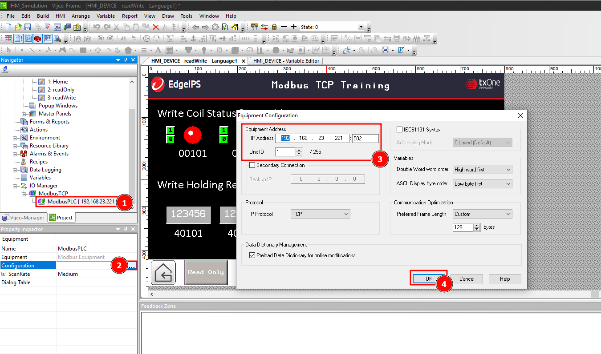
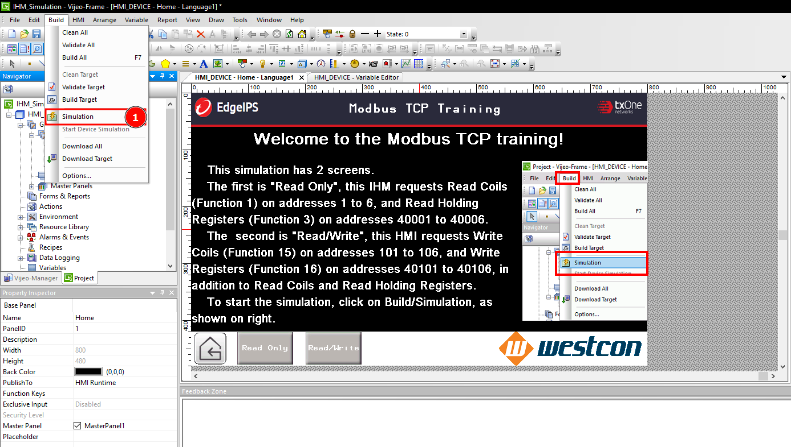
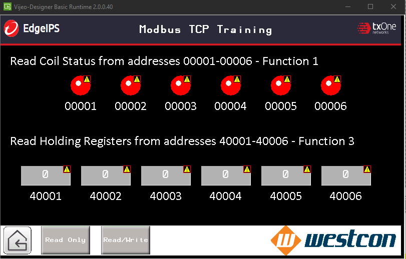

# Guide to simulate PLC and HMI Communication over Modbus TCP

  - [1. Engineering Tools Download](#download-softwares)
  - [2. PLC Project](#plc-project)
  - [3. HMI Project](#hmi-project)
  - [4. Troubleshooting](#troubleshooting)

## 1. Engineering Tools Downloads

Download and install the PLC software EcoStruxure Machine Expert Basic [here] and the HMI software EcoStruxure Vijeo Designer Basic [here]. The currently sample project supports Machine Expert Basic version 1.2 SP1 Patch 1 build 65760 and Vijeo Designer Basic V2.0.0.48.

## 2. PLC Project

Download the sample PLC project [here], unzip and open (Ctrl+O) the file.
The project has the following Modbus address characteristics:

* Read Coils:  The sample has Modbus Coils addresses 01 to 06 mapped to sequential blinkers, the coils will blink each second in sequential order.
* Read Holding Registers:  Modbus Registers 40001 to 40006 are mapped to counters, and they have the following ranges: 40001 [0:100], 40002 [100:200], 40003 [300:400], 40005 [500:600] and 40006 [500:700].
* Read/Write Coils:  Modbus Coils addresses 101 to 106 are not mapped to any value, so the HMI can toggle them and read back.
* Read/Write Holding Registers:  Modbus Registers 40101 to 40106 are not mapped to any values, the HMI can write them and read back.

The simulation opens the local 502 port for Modbus TCP communication. To start the PLC simulation follow the steps below:

1. Click on Simulator Icon or enter Ctrl+B to Lauch Simulator.
2. Click on Play Icon or enter Ctrl+M to Start PLC.

## 3. HMI Project

Download the sample HMI project [here](./samples/PLC_Simulation.smbp), unzip and import following the steps below:

1. Click to cancel the Welcome Screen.
2. **Right Click** Vijeo-Manager item on Navigator tool.
3. CLick on Import Project.
4. Select the sample project.
5. Click to enable Open Project After Import.
6. Open the project.

Configure the PLC simulator IP by changing the ModbusPLC Server Equipment configuration on IO Manager/ModbusTCP Driver. Follow the steps below:

1. Scroll down on Navigator tool menu, click on ModbuPLC.
2. On Property Inspector menu, click on the 3 dots option.
3. On Equipment Configuration, change the IP address to the computer running the PLC simulation IP.
4. Click on OK to apply the configuration.

The HMI project has the following screens:
* Home: Welcome information
* Read Only: Screen that requests Read Coils (Function 1) on addresses 01 to 06, and Read Holding Registers (Function 3) on addresses 40001 to 40006.
* Read/Write: Screen where user can Write on Coils (Function 15) on addresses 101 to 106 by clicking on ones and zeros to change their values, also user can Write on Registers (Function 16) on addresses 40101 to 40106 by clicking on the number field and inputting integer values.

To run the HMI simulation, follow the steps below:

1. On Build menu, click Simulation to lauch the simulator.

## 4. Troubleshooting

If an attention marker appears over the screen objects, as shown below, that means no communication with the PLC Simulation could be establish. If the miscommunication was not on purpose, please check: the network settings on both machines and the IP address configured for PLC Simulaton on Vijeo Designer Basic.

