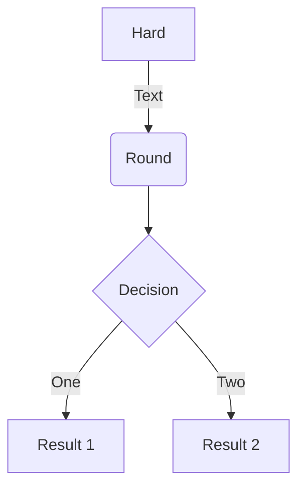

# # Configuração de Link Backup IG502/IG902

  - [1. Introdução ao Link Backup](#intro-linkbackup)
  - [2. Configuração do Link Backup](#config-linkbackup)
    - [2.1 SLA](#sla)
    - [2.2 Track](#track)
    - [2.3 Interface Backup](#interfacebackup)
  - [3. Status](#status)
  - [4. Notas](#notas)

## 1. Introdução ao Link Backup

The InGateway902 (IG902 for short) series is a new-generation series of 4G edge computing gateways developed by InHand Networks for the Industrial IoT sector. It provides omnipresent.

The following figure shows common application scenarios of the IG902.

## 2. Configuração do Link Backup
Each edge computing gateway product is delivered with accessories (such as standard accessories) frequently used at the customer site. Check the received product against the packing list carefully. If any accessory is missing or damaged, contact the InHand sales personnel 

### 2.1 SLA

### 2.2 Track

### 2.3 Interface Backup

## 3 Status
The panel introduction of IG902 is shown in the figure below (The IG900 series product is applicable to multiple panel appearances, as they have the same installation method. Refer to the actual product during operation.):  

## 3 Notas
The panel introduction of IG902 is shown in the figure below (The IG900 series product is applicable to multiple panel appearances, as they have the same installation method. Refer to the actual product during operation.):

## UML diagrams

You can render UML diagrams using [Mermaid](https://mermaidjs.github.io/). For example, this will produce a sequence diagram:

