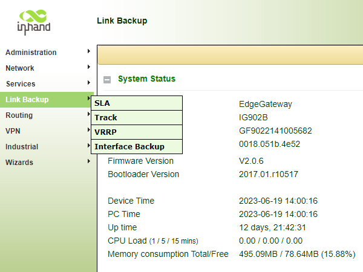
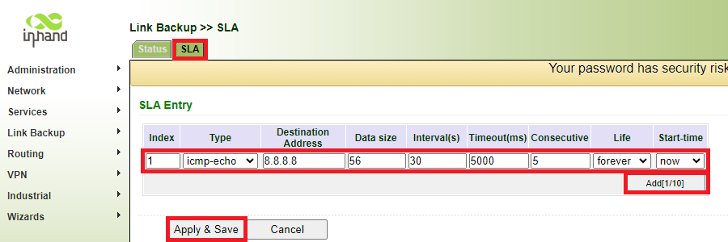
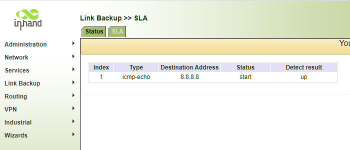
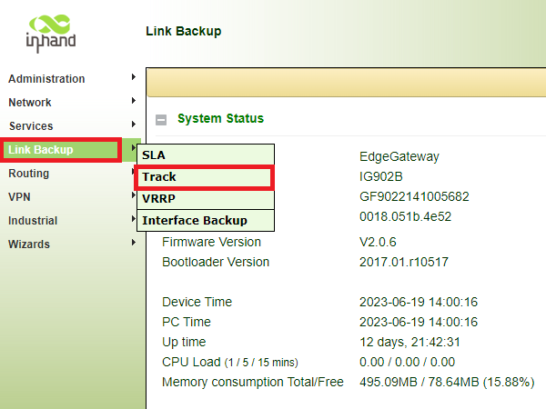
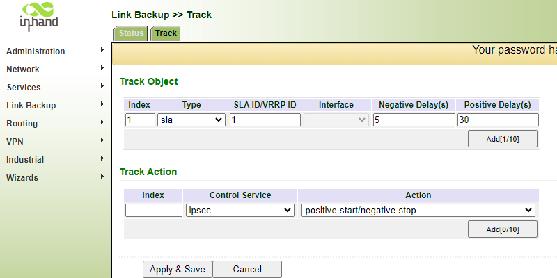
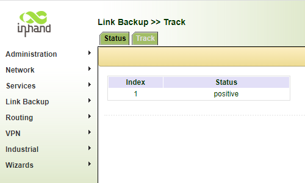
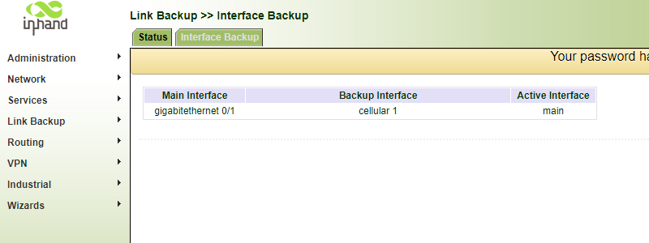

# Configuração de Link Backup IG502/IG902

  - [1. Introdução ao Link Backup](#intro-linkbackup)
  - [2. Configuração do Link Backup](#config-linkbackup)
    - [2.1 SLA](#sla)
      - [2.1.1 SLA Status](#sla-status)
    - [2.2 Track](#track)
      - [2.1.1 Track Status](#track-status)
    - [2.3 Interface Backup](#interfacebackup)
      - [2.1.1 Interface Backup Status](#interfacebackup-status)
  - [4. Notas](#notas)

## 1. Introdução ao Link Backup

Link Backup é uma função dos InGateways InHand IG502 e IG902. Essa função permite que seja configurada 2 formas de acesso à alguma rede Internet, sendo uma delas a forma principal e outra sendo secundária cumprindo o papel de Backup.

## 2. Configuração do Link Backup
Para configurar o Link Backup acesse a aba Advanced. Um pop-up solicitando usuário e senha deve surgir, se não abrir verifique se o navegador está bloqueando esse pop-up.
Abaixo a indicação da aba Advanced:

### 2.1 SLA
O primeiro passo da configuração do Link Backup é criar um **SLA** (Service Level Agreement), que irá monitorar a condição de internet seguindo os parâmetros definidos.
Acesse o item SLA através da aba Link Backup, como ilustrado abaixo:

O **SLA** é parametrizado conforme abaixo:
-  **Type**:  **icmp-echo**, mais popularmente conhecido como "ping"
-  **Destination Address**:  um endereço IP ao qual o pacote ICMP será direcionado
-  **Data size**:  tamanho do pacote (56 bytes por padrão)
-  **Interval(s)**:  tempo entre testes do monitoramento
-  **Timeout(ms)**:  tempo de espera do echo do pacote ICMP
-  **Consecutive**:  quantidade de testes consecutivos a cada intevalo de monitoramento 

Clique em **Add** para adicionar e **Apply** para configurar.

#### 2.1.1 SLA Status
Na aba **Status** é possível acompanhar o resultado dos _Service Level Agreements_, caso esteja _up_ o monitoramento o pacote ICMP foi bem sucedido:

### 2.2 Track
O segundo passo da configuração é criar um **Track**, que irá possui um **Index** no qual será apontado na tabela de Link Backup e roteamento.
Acesse o item Track através da aba Link Backup, como ilustrado abaixo:

O **Track** é parametrizado conforme abaixo:
-  **Index**:  número que indica o índice do **Track**
-  **Type**:  tipo do _Tracking_, neste caso será **SLA**
-  **SLA ID/VRRP ID**:  _ID_ do **SLA** já configurado
-  **Negative Delay**:  tempo para que o **Track** seja declarado como _Down_ (fora de funcionamento)
-  **Positive Delay**:  tempo para que o **Track** seja declarado como _Up_ (em funcionamento)

Clique em **Add** para adicionar e **Apply** para configurar.

#### 2.2.1 Track Status
Na aba **Status** é possível acompanhar o resultado dos _Trackings_, caso esteja _positive_ o monitoramento do SLA foi bem sucedido:

### 2.3 Interface Backup
O terceiro passo da configuração é definir qual interface será a principal e a secundária.
Acesse o item Interface Backup através da aba Link Backup, como ilustrado abaixo:

O item **Interface Backup** é parametrizado conforme abaixo:
-  **Main Interface**:  interface de rede principal
-  **Backup Interface**:  interface de rede secundária
-  **Startup Delay**:  tempo entre a incialização do InGateway e a inicialização do serviço de Link Backup
-  **Up Delay**:  tempo entre o **Track** em _Up_ e a troca da inteface de rede para a principal
-  **Down Delay**:  tempo entre o **Track** em _Down_ e a troca da inteface de rede para a secundária

Clique em **Add** para adicionar e **Apply** para configurar.

#### 2.3.1 Interface Backup Status
Na aba **Status** é possível acompanhar qual interface está ative, a principal é denotada como _main_ e a secundária como _backup_:

## 3 Notas
The panel introduction of IG902 is shown in the figure below (The IG900 series product is applicable to multiple panel appearances, as they have the same installation method. Refer to the actual product during operation.):
